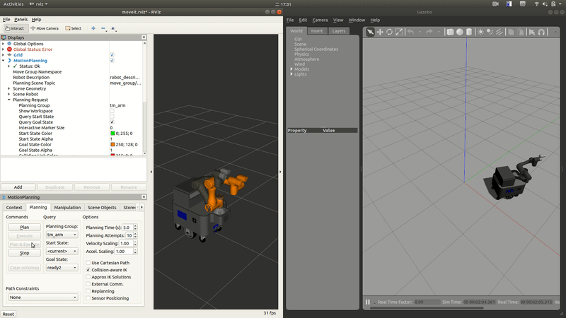

# mars_lite_simulation_ws
Experimental ROS workspace for the simulation of the MARS mobile manipulator.



### Dependencies
```bash
# Make sure you have installed ROS1 and Moveit first !!
sudo apt-get update
sudo apt-get install -y ros-${ROS_DISTRO}-joint-trajectory-controller \
    ros-${ROS_DISTRO}-gripper-action-controller \
    ros-${ROS_DISTRO}-hector-models \
    ros-${ROS_DISTRO}-ira-laser-tools
```

### Instructions
```bash
# Terminal 1 -- launch gazebo
roslaunch mars_lite_description mars_gazebo.launch realsense_enabled:=true
# If you have launched other gazebo environment already, 
# please use "roslaunch mars_lite_description spawn_mars.launch realsense_enabled:=true" to spawn robot model.


# Terminal 2 -- launch moveit gui
roslaunch mars_lite_moveit_config mars_lite_moveit_planning_execution_gz.launch
```