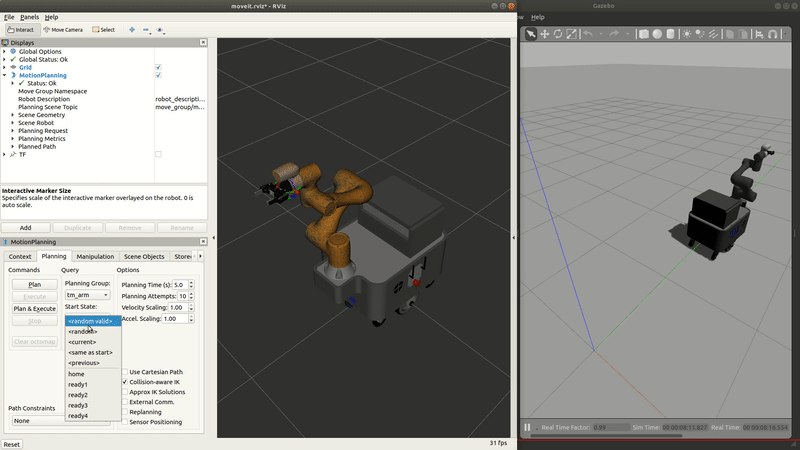

# mars_lite_simulation_ws
Experimental ROS workspace for the simulation of the MARS mobile manipulator.



### Dependencies
```bash
# Make sure you have installed ROS1 and Moveit first !!
sudo apt-get update
sudo apt-get install -y ros-${ROS_DISTRO}-joint-trajectory-controller \
    ros-${ROS_DISTRO}-gripper-action-controller
```